# StayFlow — Architecture

> Product context: [PRD.md](PRD.md). Data model: [SCHEMA.md](SCHEMA.md). Business rules: [RULES.md](RULES.md).

## High Level Architecture

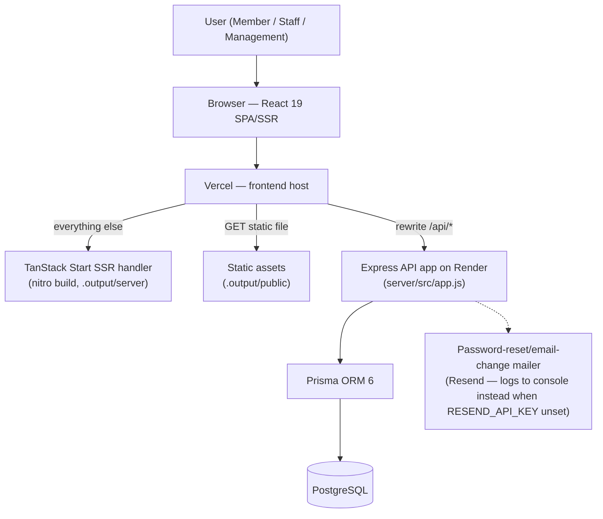

**Components**

| Component       | Role                                                                                                         |
| --------------- | ------------------------------------------------------------------------------------------------------------ |
| Browser (React) | Renders portals, holds non-sensitive user profile in `zustand`+`persist`; JWT never touches JS               |
| Vercel frontend | Serves the nitro build (static assets + TanStack Start SSR) and rewrites `/api/*` server-side to Render      |
| Express API     | REST endpoints, auth, RBAC, rate limiting, security headers                                                  |
| Prisma          | Typed DB access + migrations                                                                                 |
| PostgreSQL      | System of record, hosted on Neon (free tier), connected via `DATABASE_URL` on Render                         |
| Mailer          | Reset/email-change link delivery via Resend; logs the link to console instead when `RESEND_API_KEY` is unset |

## Complete System Architecture

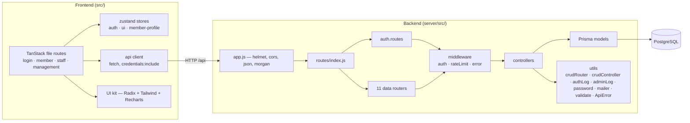

- **Integrations / external APIs:** Resend (email) is the only wired provider, and only if `RESEND_API_KEY` is set — falls back to console-logging otherwise. No payment, SMS, maps, analytics SaaS, or third-party auth.
- **Service communication:** single process; frontend↔backend over same-origin HTTP `/api`; backend↔DB over Prisma (Postgres wire protocol).

## End-to-End System Flow

### Login / Authentication

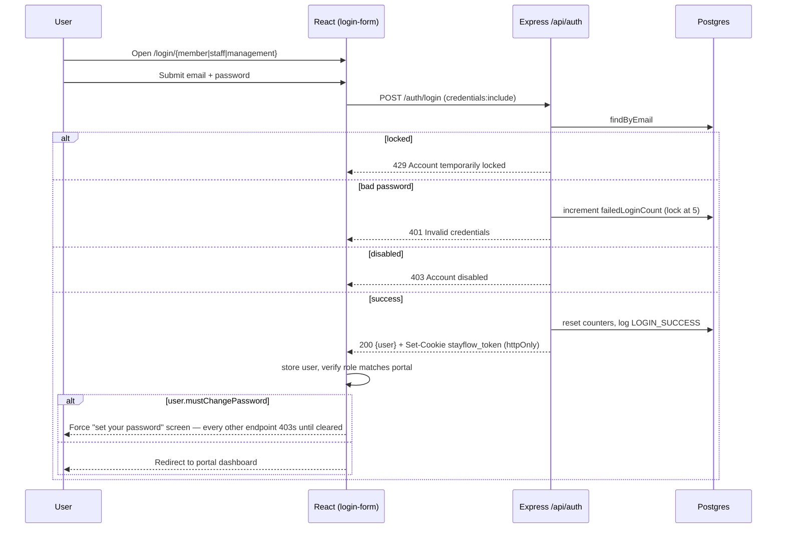

> **No self-registration.** There is no public account-creation endpoint. Resident logins are issued by MANAGEMENT (`POST /residents/:id/create-login`, temp password + `mustChangePassword: true`); STAFF/MANAGEMENT accounts are seed/Prisma-Studio only. See [RULES.md](RULES.md#resident-onboarding-no-self-registration).

### Booking

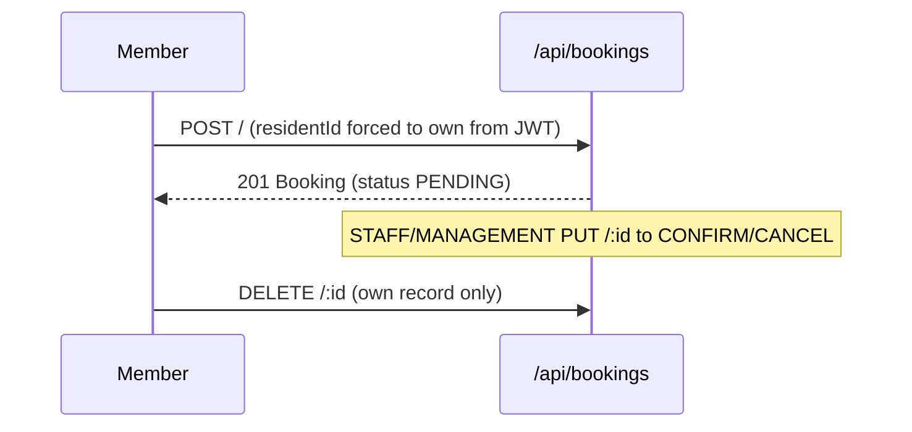

### Guest Pass Lifecycle

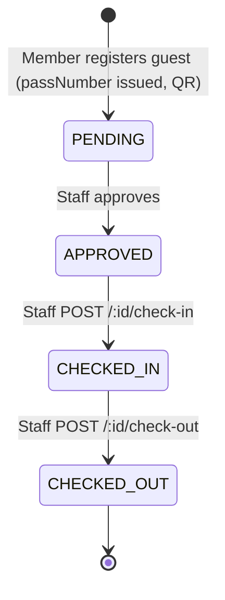

### Payment Flow

> Not implemented. No payment gateway, checkout, or billing code exists.

### Notification Flow

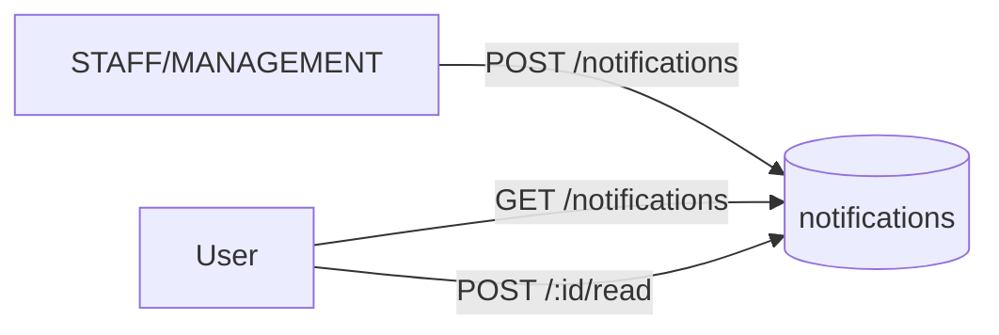

### Background Jobs / Queues / Scheduled Tasks

> None present. No queue, worker, cron, or scheduler. All work is synchronous request/response. The one async side-effect is fire-and-forget audit logging (`logAuthEvent`).

### Error Handling Flow

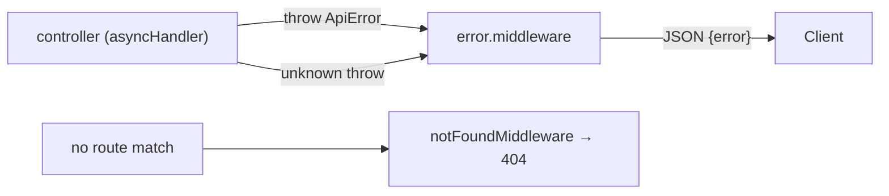

## Folder Structure

<details>
<summary><strong>Expand tree</strong></summary>

```
StayFlow/
├── vite.config.ts             # Vite 8 + TanStack Start + nitro + Tailwind + React plugins
├── package.json               # Frontend deps + scripts (dev/build/test/lint)
├── components.json            # shadcn/ui config
├── .env / .env.example        # Single env file for frontend + backend (see SECURITY.md) — no server/.env
├── public/                    # Static public assets
├── .output/                   # Nitro build output (public + server) — generated
├── src/
│   ├── router.tsx             # TanStack Router setup
│   ├── routeTree.gen.ts       # Generated route tree (tsr)
│   ├── styles.css             # Tailwind entry + design tokens
│   ├── routes/                # File-based routes
│   │   ├── __root.tsx         # Root layout/shell
│   │   ├── index.tsx          # Landing
│   │   ├── login/{member,staff,management}.tsx
│   │   ├── forgot-password.tsx / reset-password.tsx
│   │   ├── member/  (index, facilities, dining, guests, events, notices, profile)
│   │   ├── staff/   (index, bookings, dining, facilities, guests, events)
│   │   └── management/ (index, users, facilities, restaurants, events, notices, analytics, reports)
│   ├── components/
│   │   ├── stayflow/          # App components (app-shell, sidebar, kpi-card, charts/, qr-code…)
│   │   │   ├── users/          # management/users.tsx split: tabs, form sheets, action dialogs
│   │   │   └── profile/        # member/profile.tsx split: avatar/family/vehicle dialogs, email section
│   │   └── ui/                # shadcn/Radix primitives (button, dialog, table, calendar…)
│   └── lib/
│       ├── api/client.ts      # fetch wrapper (credentials:include)
│       ├── store/             # zustand: auth-store, ui-store, member-profile
│       ├── hooks/             # use-require-auth, use-portal-preference
│       ├── mock/               # Shared TS domain types (no data — see live-analytics.ts for derived stats)
│       └── {avatar,booking-slots,export-csv,session,utils}.ts
└── server/
    ├── server.js              # Standalone API entry (dev): prisma.$connect + app.listen
    ├── package.json           # Backend deps + prisma scripts
    ├── prisma/
    │   ├── schema.prisma       # Data model (see SCHEMA.md)
    │   ├── migrations/0_init/  # SQL migration
    │   └── seed.js             # Seed residents/staff/facilities/users
    ├── scripts/reset-test-passwords.js
    └── src/
        ├── app.js             # Express app (helmet, cors, json, morgan, routes)
        ├── config/{env.js,db.js}
        ├── routes/            # index + auth + 11 resource routers
        ├── controllers/       # Per-resource controllers
        ├── models/            # Prisma-backed models
        ├── middleware/        # auth, rateLimit, error
        └── utils/             # crudRouter, crudController, authLog, adminLog, password, mailer, validate, ApiError, asyncHandler
```

</details>

## Technology Stack

| Purpose          | Technology                | Version   | Description                                                    |
| ---------------- | ------------------------- | --------- | -------------------------------------------------------------- |
| UI framework     | React                     | ^19.2     | Component UI, SSR-capable                                      |
| Meta-framework   | TanStack Start / Router   | latest    | File routing, SSR, server functions                            |
| Build tool       | Vite                      | ^8.0      | Dev server + bundler                                           |
| Language         | TypeScript                | ^6.0      | Frontend types                                                 |
| Styling          | Tailwind CSS              | ^4.1      | Utility-first + `@tailwindcss/vite`                            |
| UI primitives    | Radix UI / shadcn pattern | ^1.6      | Accessible components                                          |
| Icons            | lucide-react              | ^0.577    | Icon set                                                       |
| Charts           | Recharts                  | ^3.9      | Analytics visuals                                              |
| Client state     | zustand (+persist)        | ^5.0      | Auth/UI stores                                                 |
| Dates            | date-fns                  | ^4.4      | Date math, booking slots                                       |
| QR               | qrcode                    | ^1.5      | Guest-pass QR codes                                            |
| Toasts           | in-house (`lib/toast.ts`) | —         | `useSyncExternalStore`-based; see note below                   |
| Runtime          | Node.js                   | —         | Prod server + dev                                              |
| API framework    | Express                   | ^4.21     | REST API                                                       |
| ORM              | Prisma                    | ^6.3      | DB access + migrations                                         |
| Database         | PostgreSQL                | —         | System of record                                               |
| Auth             | jsonwebtoken              | ^9.0      | JWT sign/verify                                                |
| Hashing          | bcryptjs                  | ^2.4      | Password hashing (cost 12)                                     |
| Rate limiting    | express-rate-limit        | ^8.5      | General `/api` limiter + tighter login/password-reset limiters |
| Security headers | helmet                    | ^8.3      | HSTS, nosniff, frameguard                                      |
| CORS             | cors                      | ^2.8      | Allowlist-based                                                |
| Logging          | morgan                    | ^1.10     | HTTP request logs                                              |
| Tests            | Vitest + Testing Library  | ^4.1      | Unit/component tests                                           |
| Lint/format      | ESLint + Prettier         | ^9 / ^3.8 | `@tanstack/eslint-config`                                      |

**Why toasts are hand-rolled:** sonner's `<Toaster>` never receives its mount effect under this app's SSR shell — its internal `subscribe()` call never registers, in both the 1.x and 2.x implementations, so every `toast()` call silently no-ops. `lib/toast.ts` + `components/ui/toast-viewport.tsx` replace it with a minimal store on `useSyncExternalStore`, React's own primitive for external state + SSR, which sidesteps that class of bug entirely. Same `toast.success/error/info(message, { description? })` call shape at all 28 call sites.

## System Modules

Each resource follows **route → middleware → controller → model → Prisma**. Generic CRUD is factored into `utils/crudRouter.js` + `utils/crudController.js`; resources with ownership rules add explicit routers.

| Module                  | Purpose                                                              | Read roles            | Write roles                 | Notable endpoints                 |
| ----------------------- | -------------------------------------------------------------------- | --------------------- | --------------------------- | --------------------------------- |
| **Auth**                | Login, logout, password reset/change, session — no self-registration | public / self         | —                           | `/auth/*`                         |
| **Residents**           | Resident directory + profile + login issuance                        | STAFF, MGMT           | MGMT only                   | CRUD, `/:id/create-login`         |
| **Staff**               | Staff directory                                                      | STAFF, MGMT           | MGMT                        | CRUD                              |
| **Facilities**          | Amenities catalog                                                    | any auth              | STAFF, MGMT                 | CRUD                              |
| **Bookings**            | Facility reservations                                                | STAFF list; owner get | member create; STAFF update | `/resident/:id`, ownership-gated  |
| **Restaurants**         | Dining venues                                                        | any auth              | MGMT only                   | CRUD                              |
| **Tables**              | Restaurant tables                                                    | any auth              | MGMT only                   | `/restaurant/:id`                 |
| **Dining Reservations** | Table bookings                                                       | STAFF list; owner get | member create; STAFF update | `/resident/:id`, ownership-gated  |
| **Guests**              | Guest passes + check-in/out                                          | STAFF list; owner get | member create/edit own      | `/:id/check-in`, `/:id/check-out` |
| **Events**              | Community events + RSVP                                              | any auth              | MGMT only                   | `/:id/rsvp`, `/:id/rsvp/cancel`   |
| **Notices**             | Announcements                                                        | any auth              | MGMT only                   | CRUD                              |
| **Notifications**       | In-app notifications                                                 | any auth              | STAFF, MGMT create/delete   | `/:id/read`                       |

_Inputs:_ JSON bodies + JWT (cookie/Bearer). _Outputs:_ JSON. _Connected services:_ PostgreSQL via Prisma only.

## API Documentation

Base path: `/api`. Auth via `stayflow_token` httpOnly cookie **or** `Authorization: Bearer <jwt>`. All non-auth routers sit behind `requireAuth`. Errors return `{ "error": "message" }` with the status below.

### Auth — `/api/auth`

No public account-creation endpoint exists — see [RULES.md](RULES.md#resident-onboarding-no-self-registration).

| Method | URL                | Purpose                                                         | Auth                                 | Request                         | Success                     | Errors        |
| ------ | ------------------ | --------------------------------------------------------------- | ------------------------------------ | ------------------------------- | --------------------------- | ------------- |
| POST   | `/login`           | Sign in                                                         | public (rate-limited)                | `{email,password}`              | 200 `{token,user}` + cookie | 401, 403, 429 |
| POST   | `/logout`          | Clear cookie                                                    | any                                  | —                               | 204                         | —             |
| POST   | `/forgot-password` | Request reset link                                              | public (rate-limited)                | `{email}`                       | 200 generic message         | 400           |
| POST   | `/reset-password`  | Set new password (clears `mustChangePassword`)                  | public (rate-limited)                | `{token,password}`              | 200 message                 | 400           |
| POST   | `/change-password` | Change password (clears `mustChangePassword`), re-issues cookie | requireAuth (rate-limited)           | `{currentPassword,newPassword}` | 200 message                 | 400, 401      |
| POST   | `/change-email`    | Request email change (verify-then-apply)                        | requireAuth (rate-limited)           | `{newEmail,currentPassword}`    | 200 message                 | 400, 401, 409 |
| POST   | `/confirm-email`   | Apply a verified email change                                   | public, token-bearing (rate-limited) | `{token}`                       | 200 message                 | 400           |
| GET    | `/me`              | Current user                                                    | requireAuth                          | —                               | 200 `user`                  | 401, 404      |

### Resource routers (all under `requireAuth`)

Generic CRUD (`GET /`, `GET /:id`, `POST /`, `PUT /:id`, `DELETE /:id`) applies to **residents, staff, facilities, restaurants, tables, events, notices** with the role gates in System Modules above — reads stay open to STAFF/MGMT (or wider); writes on restaurants/tables/events/notices/residents are MGMT-only since STAFF has no screens that use them. Extra endpoints:

| Method              | URL                                                            | Purpose                                              | Role                |
| ------------------- | -------------------------------------------------------------- | ---------------------------------------------------- | ------------------- |
| POST                | `/residents/:id/create-login`                                  | Issue a resident's login (temp password, shown once) | **MGMT only**       |
| GET                 | `/bookings`                                                    | List all (paginated)                                 | STAFF/MGMT          |
| GET                 | `/bookings/resident/:residentId`                               | Resident's bookings                                  | owner or STAFF/MGMT |
| POST                | `/bookings`                                                    | Create (residentId forced from JWT)                  | any member          |
| PUT                 | `/bookings/:id`                                                | Update / confirm                                     | STAFF/MGMT          |
| DELETE              | `/bookings/:id`                                                | Cancel own                                           | owner               |
| GET/POST/PUT/DELETE | `/dining-reservations/*`                                       | Same shape as bookings (paginated list)              | same                |
| GET                 | `/guests/resident/:residentId`                                 | Host's guests                                        | owner or STAFF/MGMT |
| POST                | `/guests/:id/check-in` · `/check-out`                          | Front-desk actions                                   | STAFF/MGMT          |
| GET                 | `/tables/restaurant/:restaurantId`                             | Tables by venue                                      | any auth            |
| POST                | `/events/:id/rsvp` · `/rsvp/cancel`                            | RSVP toggle                                          | member (own)        |
| GET                 | `/notifications`                                               | List (paginated, cross-property feed)                | STAFF/MGMT          |
| GET                 | `/notifications/resident/:id` · `/staff/:id`                   | Own scoped feed (paginated)                          | owner               |
| POST                | `/notifications/:id/read`                                      | Mark read                                            | owner or STAFF/MGMT |
| POST                | `/notifications/resident/:id/read-all` · `/staff/:id/read-all` | Mark all read (own feed)                             | owner               |
| POST                | `/notifications/read-all`                                      | Mark all read (every notification)                   | **MGMT only**       |
| GET                 | `/health`                                                      | Liveness → `{status:'ok',time}`                      | public              |

## Deployment

**Model:** split hosting, two services. Vercel builds and serves the frontend, and proxies `/api/*` server-side to a standalone Render service running the Express API — the browser only ever sees one origin, so the httpOnly auth cookie (`SameSite=Lax`) works normally.

The merged API+SSR+static Node server that predated this split has been removed — the frontend build (`nitro` plugin, `.output/`) is Vercel's to serve, and Render runs `server/server.js` directly.

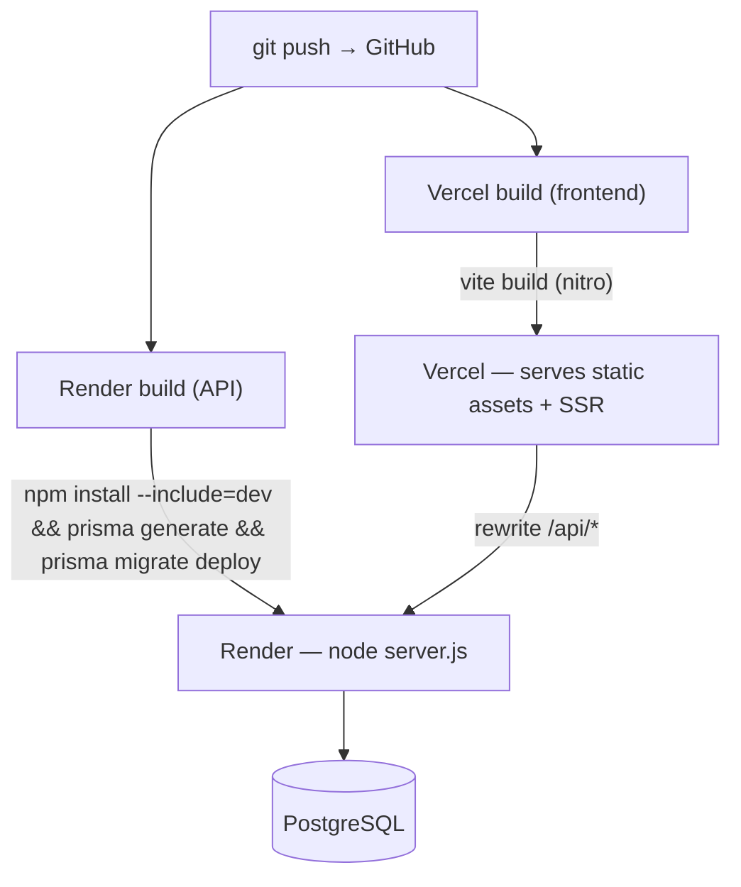

- **Local dev (frontend + API together):** `npm install && npm run dev` (Vite on :3000). Backend env in root `.env` powers this path.
- **Local dev (API standalone):** `cd server && npm install && npm run dev` (`node --watch`, :4000). `server/src/config/env.js` resolves the root `.env` from its own module path, so this works from either directory without a second copy of the file (see [SECURITY.md](SECURITY.md#environment-variables)).
- **Push schema changes:** `./server/node_modules/.bin/prisma migrate dev --schema=server/prisma/schema.prisma --name <description>`, commit the migration, then push — Render's build runs `prisma migrate deploy`; see [SCHEMA.md](SCHEMA.md#schema-change-workflow).
- **Docker / Compose / Kubernetes:** none present. **CI:** `.github/workflows/ci.yml` — lint, typecheck, test, build, plus separate `npm audit` and tracked-file secret-scan jobs.

### Proxy chain and client IP

Two proxies sit in front of the API in production:

```
browser → Vercel edge (rewrite /api/*) → Render router → Express
```

This matters for anything that reads the caller's address. `app.set('trust proxy', …)` is 2 in production (overridable with `TRUST_PROXY_HOPS`), because trusting a single hop made `req.ip` resolve to the Render router — an address shared by every user — which silently converted all per-IP rate limits into global ones. `rateLimit.middleware.js` keys off the resolved client address and logs loudly if it cannot resolve one.

### Health checks

| Endpoint                | Purpose                                                                                                     | Touches DB |
| ----------------------- | ----------------------------------------------------------------------------------------------------------- | ---------- |
| `GET /api/health`       | Liveness — is the process serving? A database blip must not cause the platform to restart a healthy process | No         |
| `GET /api/health/ready` | Readiness — can this instance actually serve? 503 with a bounded 2s probe timeout                           | Yes        |

Both are mounted ahead of the rate limiter and access log, so continuous platform probes neither consume the shared `/api` request budget nor drown the logs.

### Graceful shutdown

`SIGTERM`/`SIGINT` stop accepting connections, wait for in-flight requests via `server.close()`, disconnect Prisma, then exit — with a 15s force-exit timer well inside Render's 30s SIGKILL window. Before this, every deploy dropped whatever was mid-request. `unhandledRejection` and `uncaughtException` are handled explicitly so the cause is logged rather than the process vanishing silently.

## Configuration Guide

| File                                      | Purpose                                                              |
| ----------------------------------------- | -------------------------------------------------------------------- |
| `vite.config.ts`                          | Vite plugins: devtools, tailwind, TanStack Start, React              |
| `tsconfig.json` / `tsr.config.json`       | TS config + TanStack Router codegen                                  |
| `eslint.config.js` / `prettier.config.js` | Lint + format (`@tanstack/eslint-config`)                            |
| `components.json`                         | shadcn/ui generator config                                           |
| `server/prisma/schema.prisma`             | Data model, enums, datasource — see [SCHEMA.md](SCHEMA.md)           |
| `server/src/config/env.js`                | Env validation + defaults (required: `DATABASE_URL`, `JWT_SECRET`)   |
| `server/src/config/db.js`                 | Prisma client singleton                                              |
| `vercel.json`                             | Frontend build command, `/api/*` rewrite to Render, security headers |
| `render.yaml`                             | API service: build/start commands, health check, env var contract    |

## Automation

| Concern                     | Status                                                                                                     |
| --------------------------- | ---------------------------------------------------------------------------------------------------------- |
| Cron jobs / Scheduled tasks | None in repo                                                                                               |
| Queues / Background workers | None                                                                                                       |
| Webhooks                    | None                                                                                                       |
| Retries / timeouts          | Rate limiters (login 10/15min, password-reset/change/email-change 5/hr); account lock 15 min after 5 fails |
| Async side-effects          | Audit logging (`logAuthEvent`) is fire-and-forget; failures logged to console, never block auth            |

## Performance

- **Static caching:** Vercel serves hashed build assets `immutable, max-age=1y` by default; other static files carry its standard revalidating cache headers.
- **SSR:** TanStack Start server rendering for fast first paint.
- **DB indexes:** unique constraints + composite/lookup indexes on the highest-growth tables (`auth_events`, `notifications`, `bookings`, `dining_tables`, `admin_action_events`) — see [SCHEMA.md](SCHEMA.md#keys--constraints--indexes). Migration `20260805090000` added the ones every list endpoint's `orderBy` needed, replaced the plain notification FK indexes with `(owner, createdAt)` composites that serve filter and sort together, and covered `event_rsvps.residentId` — whose absence made deleting a resident sequentially scan that table, since the composite unique leads with `eventId`.
- **Response compression:** `compression` middleware on the API; Render does not gzip Node responses itself.
- **Client bundle:** recharts (~284 kB) no longer loads on the member, staff and management dashboards. `kpi-card` imported it just to draw a decorative sparkline; that is now an inline SVG (`charts/sparkline.tsx`) reproducing d3's `curveNatural` exactly. Recharts still backs the real charts on `/management/analytics`, where axes, tooltips and legends earn its cost.
- **Pagination:** `notifications`/`bookings`/`dining-reservations`/`guests` list endpoints are bounded (`take`, capped) instead of unbounded `findMany`, with `select` narrowed to only the fields each client view actually reads instead of full related rows.
- **Query dedupe:** ownership-check middleware stashes the record it fetches (`req.record`) so the handler that runs next doesn't re-fetch the same row.
- **Client state:** zustand avoids over-fetching; profile persisted locally.
- **Caching layer / Redis / CDN:** none beyond HTTP cache headers.

## Testing

- **Runner:** Vitest + `@testing-library/react` + `jsdom`; `supertest` for HTTP-level backend tests.
- **Commands:** `npm test` → `vitest run`; `npm run test:watch`; `npm run test:coverage`.
- **Authorization matrix** (`server/src/routes/authorization.matrix.test.js`): every guarded endpoint crossed with every role, driven over real HTTP through the real router and guard chain with Prisma mocked. Assertions are "403 or not 403" rather than exact status codes, so it stays an authorization contract instead of a change-detector. This is what proves making `buildCrudRouter`'s role lists mandatory did not widen or narrow access.
- **Regression suite** (`hardening.regression.test.js`): one test per defect fixed in the production-readiness pass — query validation, notification ownership, logout revocation, error redaction, request ids, health probes, origin checks, body limits.
- **Other backend units:** rate-limiter proxy keying and budget isolation, logger redaction, auth middleware, schema validation.
- **Frontend:** component tests, plus a sparkline suite that pins the hand-rolled curve to d3's `curveNatural` output, since that component replaced a recharts chart.
- **E2E:** none committed; UI verified manually through Playwright.

## Backup & Recovery

- **Database:** managed by Neon — use Neon's point-in-time restore/branching + `pg_dump` for logical backups.
- **File storage:** no user-uploaded files (images are static/remote references) — nothing app-side to back up.
- **Recovery:** restore a Neon branch/snapshot → re-run `prisma migrate deploy` → redeploy the Render service.
- **Disaster recovery:** no documented DR/runbook; relies on Neon's and Render/Vercel's platform durability.

## Diagrams

### Dependency Graph

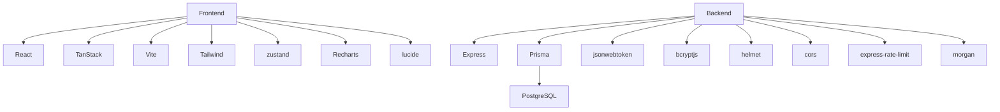

### Data Flow Diagram

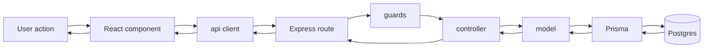

### Infrastructure Diagram

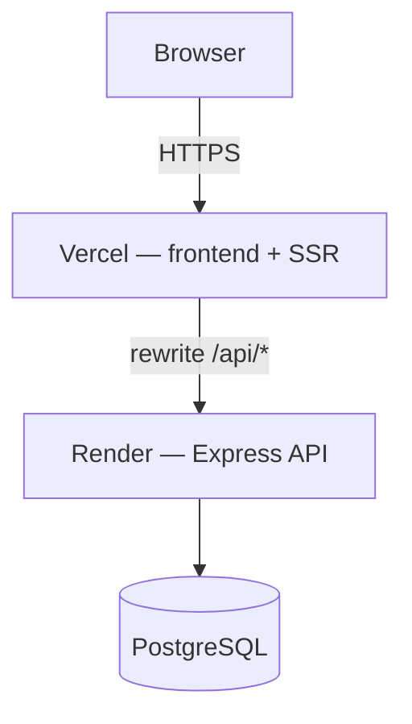

### Network Flow Diagram

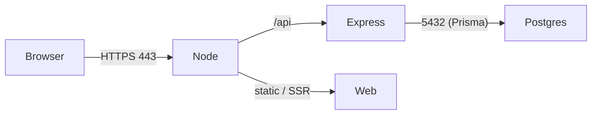

### Package Diagram

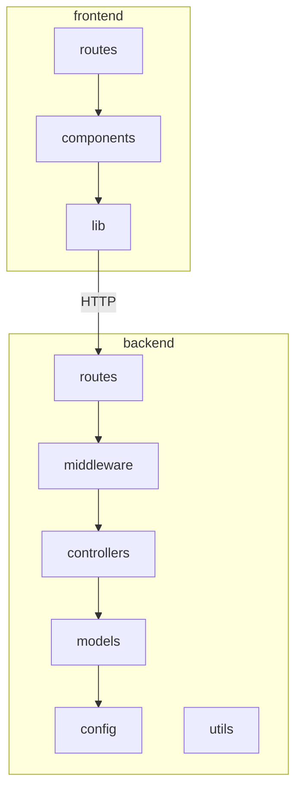

### Component Diagram

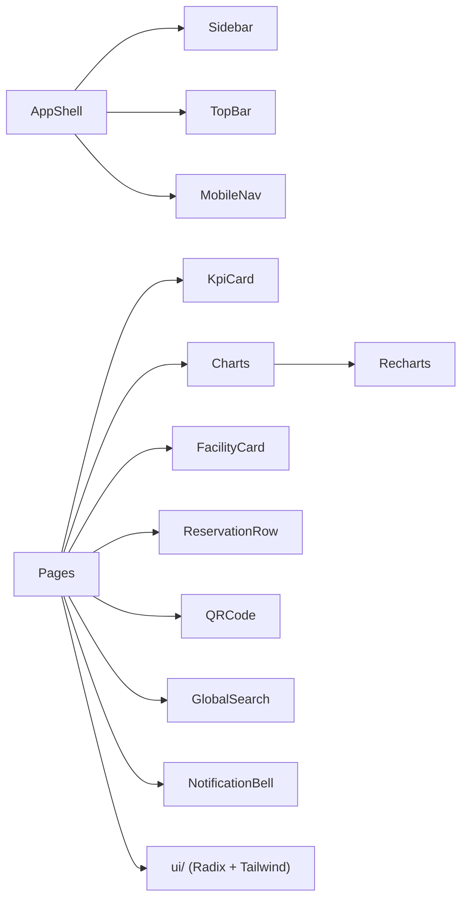

### Class Diagram (Models)

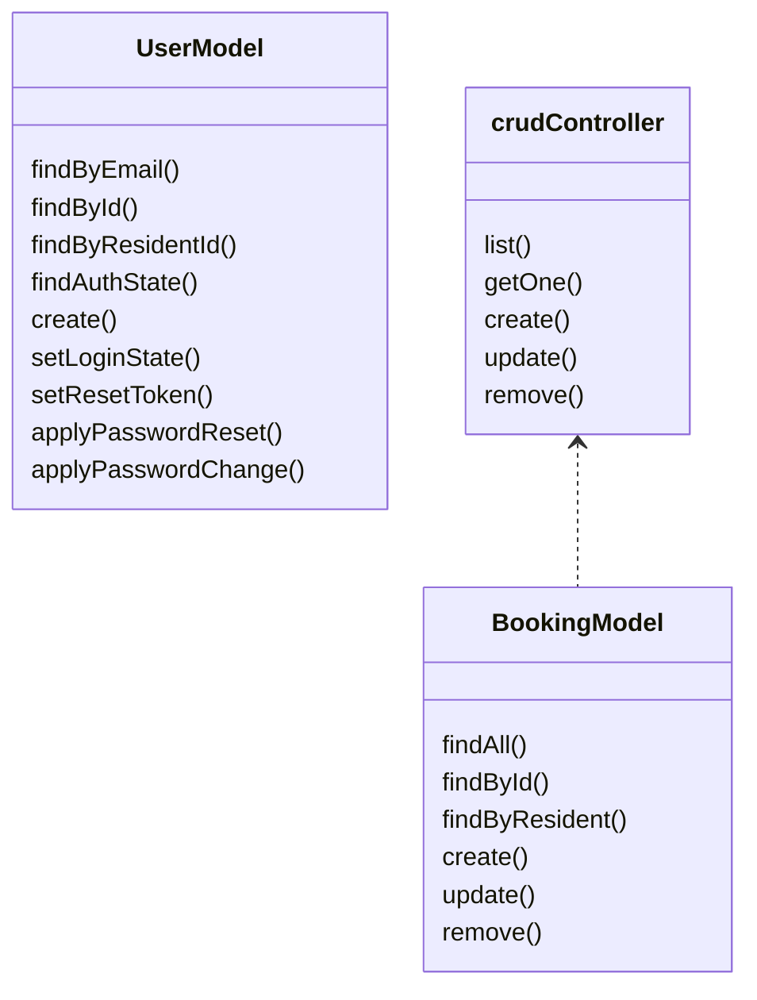

## Maintenance Guide

- **Update deps:** bump `package.json` / `server/package.json`, reinstall, run tests + lint.
- **Schema change:** edit `schema.prisma` → `prisma migrate dev` from root, commit the migration folder (see [SCHEMA.md](SCHEMA.md#schema-change-workflow)) — Render applies it on deploy via `prisma migrate deploy`.
- **Deploy:** push to GitHub → Vercel auto-builds the frontend, Render auto-builds/starts the API.
- **Rollback:** redeploy the previous build on Vercel and/or Render; revert schema with a new down migration, never by hand-editing data or deleting an applied migration file.
- **Rotate sample creds:** `TEST_PASSWORD=… node server/scripts/reset-test-passwords.js --force` (`--force` is required unconditionally — the script has no way to tell a "safe" `DATABASE_URL` from production, so it always asks for confirmation).
- **Create STAFF/MGMT users:** manually via seed / Prisma Studio (no API endpoint by design).
- **Create a resident login:** MANAGEMENT-only, via the app UI (Users page → Create Login / Add Member) or `POST /residents/:id/create-login` directly — no seed/Studio step needed.
- **Schema change via CLI:** run from repo root using server's pinned binary + explicit schema path (there's no `server/.env` for a `cd server`-relative Prisma invocation to find): `./server/node_modules/.bin/prisma migrate dev --schema=server/prisma/schema.prisma --name <description>`, then commit the generated migration.

## Credits

- **Author / Developer:** Brix
- **Contributors:** none documented.
- **Company:** not specified.
- **License:** MIT — see [LICENSE.md](../LICENSE.md).
