# StayFlow — Architecture

> Product context: [PRD.md](PRD%20%28Product%20Requirements%20Document%29.md). Data model: [Schema.md](Schema.md). Business rules: [Rules.md](Rules.md).

## High Level Architecture

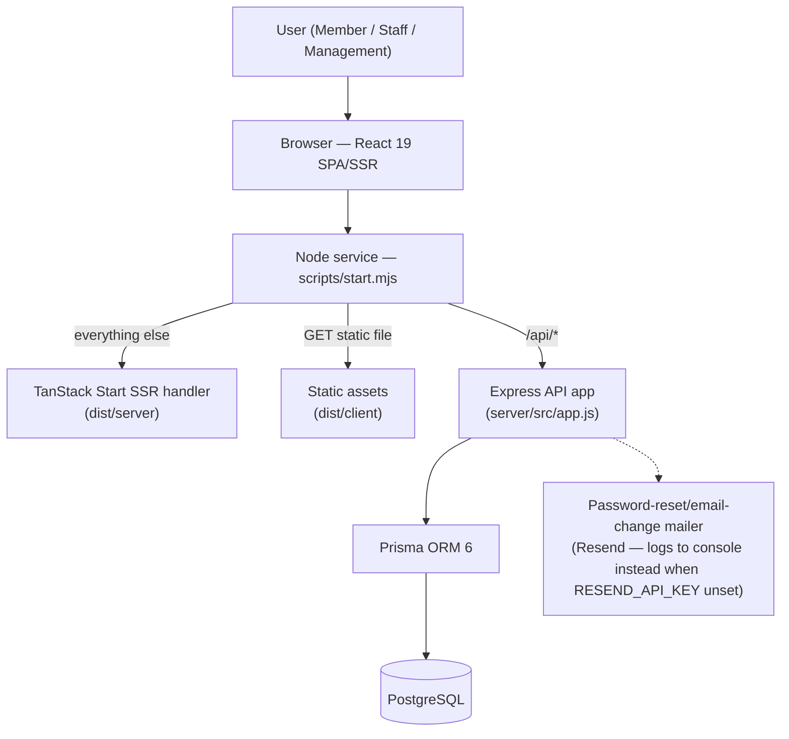

**Components**

| Component | Role |
| --- | --- |
| Browser (React) | Renders portals, holds non-sensitive user profile in `zustand`+`persist`; JWT never touches JS |
| Node service | `createServer` router: `/api` → Express, static file hit → serve `dist/client`, else → SSR `handler.fetch` |
| Express API | REST endpoints, auth, RBAC, rate limiting, security headers |
| Prisma | Typed DB access + migrations |
| PostgreSQL | System of record (Railway-managed in prod) |
| Mailer | Reset/email-change link delivery via Resend; logs the link to console instead when `RESEND_API_KEY` is unset |

## Complete System Architecture

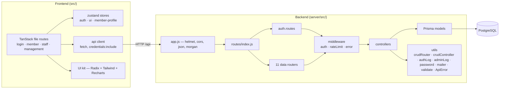

- **Integrations / external APIs:** Resend (email) is the only wired provider, and only if `RESEND_API_KEY` is set — falls back to console-logging otherwise. No payment, SMS, maps, analytics SaaS, or third-party auth.
- **Service communication:** single process; frontend↔backend over same-origin HTTP `/api`; backend↔DB over Prisma (Postgres wire protocol).

## End-to-End System Flow

### Login / Authentication

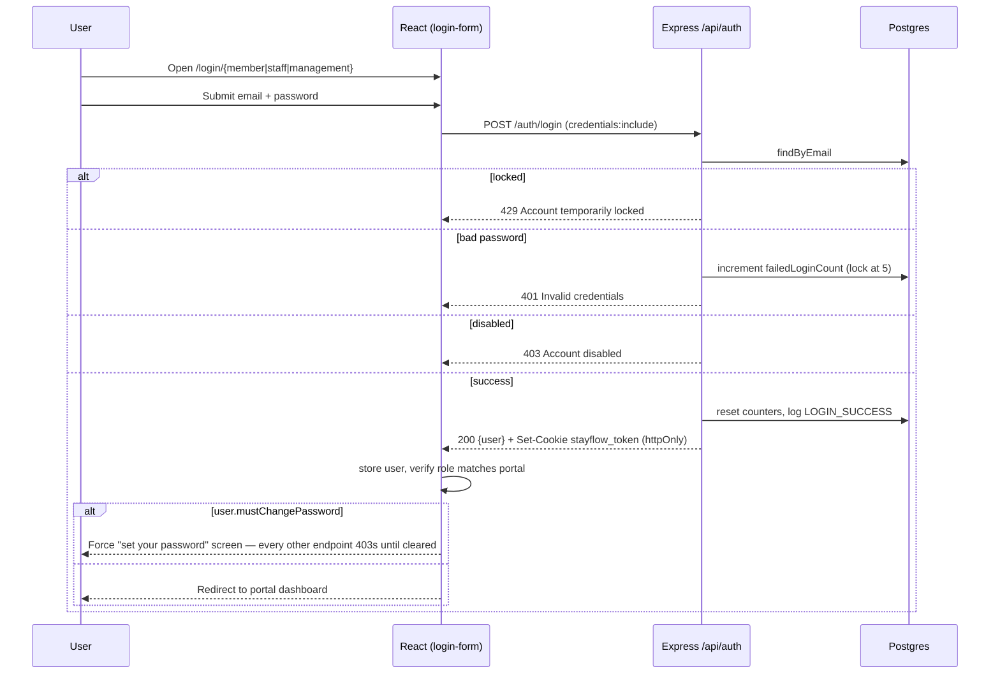

> **No self-registration.** There is no public account-creation endpoint. Resident logins are issued by MANAGEMENT (`POST /residents/:id/create-login`, temp password + `mustChangePassword: true`); STAFF/MANAGEMENT accounts are seed/Prisma-Studio only. See [Rules.md](Rules.md#resident-onboarding-no-self-registration).

### Booking

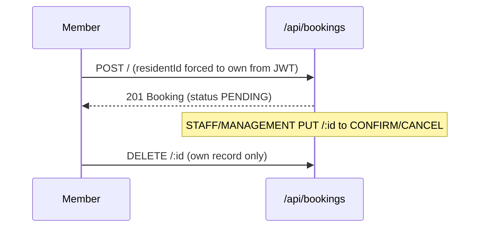

### Guest Pass Lifecycle

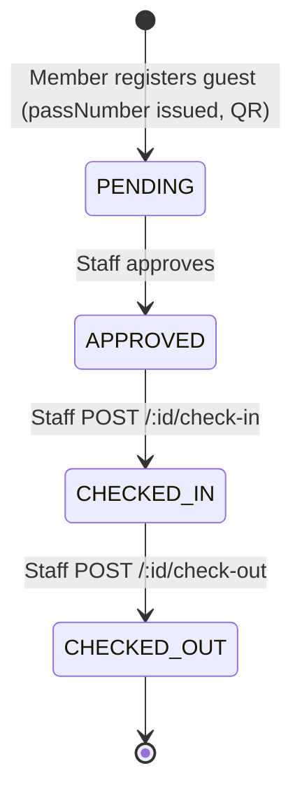

### Payment Flow

> Not implemented. No payment gateway, checkout, or billing code exists.

### Notification Flow

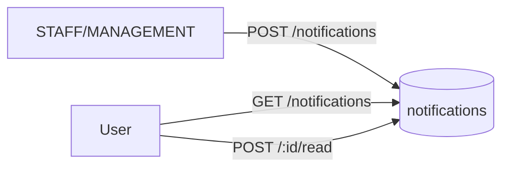

### Background Jobs / Queues / Scheduled Tasks

> None present. No queue, worker, cron, or scheduler. All work is synchronous request/response. The one async side-effect is fire-and-forget audit logging (`logAuthEvent`).

### Error Handling Flow

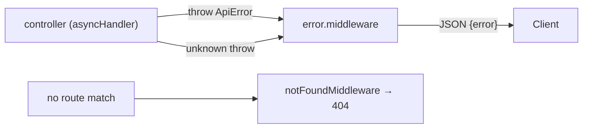

## Folder Structure

<details>
<summary><strong>Expand tree</strong></summary>

```
StayFlow/
├── scripts/start.mjs          # Prod entry: merges API + SSR + static into one Node server
├── vite.config.ts             # Vite 8 + TanStack Start + Tailwind + React plugins
├── package.json               # Frontend deps + scripts (dev/build/start/test/lint)
├── components.json            # shadcn/ui config
├── .env / .env.example        # Single env file for frontend + backend (see Security.md) — no server/.env
├── public/                    # Static public assets
├── dist/                      # Build output (client + server) — generated
├── src/
│   ├── router.tsx             # TanStack Router setup
│   ├── routeTree.gen.ts       # Generated route tree (tsr)
│   ├── styles.css             # Tailwind entry + design tokens
│   ├── routes/                # File-based routes
│   │   ├── __root.tsx         # Root layout/shell
│   │   ├── index.tsx          # Landing
│   │   ├── login/{member,staff,management}.tsx
│   │   ├── forgot-password.tsx / reset-password.tsx
│   │   ├── member/  (index, facilities, dining, guests, events, notices, profile)
│   │   ├── staff/   (index, bookings, dining, facilities, guests, events)
│   │   └── management/ (index, users, facilities, restaurants, events, notices, analytics, reports)
│   ├── components/
│   │   ├── stayflow/          # App components (app-shell, sidebar, kpi-card, charts/, qr-code…)
│   │   └── ui/                # shadcn/Radix primitives (button, dialog, table, calendar…)
│   └── lib/
│       ├── api/client.ts      # fetch wrapper (credentials:include)
│       ├── store/             # zustand: auth-store, ui-store, member-profile
│       ├── hooks/             # use-require-auth, use-portal-preference
│       ├── mock/               # Shared TS types + the two intentionally-demo analytics charts only
│       └── {avatar,booking-slots,export-csv,session,utils}.ts
└── server/
    ├── server.js              # Standalone API entry (dev): prisma.$connect + app.listen
    ├── package.json           # Backend deps + prisma scripts
    ├── prisma/
    │   ├── schema.prisma       # Data model (see Schema.md)
    │   ├── migrations/0_init/  # SQL migration
    │   └── seed.js             # Seed residents/staff/facilities/users
    ├── scripts/reset-test-passwords.js
    └── src/
        ├── app.js             # Express app (helmet, cors, json, morgan, routes)
        ├── config/{env.js,db.js}
        ├── routes/            # index + auth + 11 resource routers
        ├── controllers/       # Per-resource controllers
        ├── models/            # Prisma-backed models
        ├── middleware/        # auth, rateLimit, error
        └── utils/             # crudRouter, crudController, authLog, adminLog, password, mailer, validate, ApiError, asyncHandler
```
</details>

## Technology Stack

| Purpose | Technology | Version | Description |
| --- | --- | --- | --- |
| UI framework | React | ^19.2 | Component UI, SSR-capable |
| Meta-framework | TanStack Start / Router | latest | File routing, SSR, server functions |
| Build tool | Vite | ^8.0 | Dev server + bundler |
| Language | TypeScript | ^6.0 | Frontend types |
| Styling | Tailwind CSS | ^4.1 | Utility-first + `@tailwindcss/vite` |
| UI primitives | Radix UI / shadcn pattern | ^1.6 | Accessible components |
| Icons | lucide-react | ^0.577 | Icon set |
| Charts | Recharts | ^3.9 | Analytics visuals |
| Client state | zustand (+persist) | ^5.0 | Auth/UI stores |
| Dates | date-fns | ^4.4 | Date math, booking slots |
| QR | qrcode | ^1.5 | Guest-pass QR codes |
| Toasts | sonner | ^2.0 | Notifications UI |
| Runtime | Node.js | — | Prod server + dev |
| Package/runtime | Bun | — | Install + server build step (`bun`, `bunx`) |
| API framework | Express | ^4.21 | REST API |
| ORM | Prisma | ^6.3 | DB access + migrations |
| Database | PostgreSQL | — | System of record |
| Auth | jsonwebtoken | ^9.0 | JWT sign/verify |
| Hashing | bcryptjs | ^2.4 | Password hashing (cost 12) |
| Rate limiting | express-rate-limit | ^8.5 | Login / password-reset / password-change / email-change limiters |
| Security headers | helmet | ^8.3 | HSTS, nosniff, frameguard |
| CORS | cors | ^2.8 | Allowlist-based |
| Logging | morgan | ^1.10 | HTTP request logs |
| Tests | Vitest + Testing Library | ^4.1 | Unit/component tests |
| Lint/format | ESLint + Prettier | ^9 / ^3.8 | `@tanstack/eslint-config` |

## System Modules

Each resource follows **route → middleware → controller → model → Prisma**. Generic CRUD is factored into `utils/crudRouter.js` + `utils/crudController.js`; resources with ownership rules add explicit routers.

| Module | Purpose | Read roles | Write roles | Notable endpoints |
| --- | --- | --- | --- | --- |
| **Auth** | Login, logout, password reset/change, session — no self-registration | public / self | — | `/auth/*` |
| **Residents** | Resident directory + profile + login issuance | STAFF, MGMT | STAFF, MGMT (login issuance: MGMT only) | CRUD, `/:id/create-login` |
| **Staff** | Staff directory | STAFF, MGMT | MGMT | CRUD |
| **Facilities** | Amenities catalog | any auth | STAFF, MGMT | CRUD |
| **Bookings** | Facility reservations | STAFF list; owner get | member create; STAFF update | `/resident/:id`, ownership-gated |
| **Restaurants** | Dining venues | any auth | STAFF, MGMT | CRUD |
| **Tables** | Restaurant tables | any auth | STAFF, MGMT | `/restaurant/:id` |
| **Dining Reservations** | Table bookings | STAFF list; owner get | member create; STAFF update | `/resident/:id`, ownership-gated |
| **Guests** | Guest passes + check-in/out | STAFF list; owner get | member create/edit own | `/:id/check-in`, `/:id/check-out` |
| **Events** | Community events + RSVP | any auth | STAFF, MGMT | `/:id/rsvp`, `/:id/rsvp/cancel` |
| **Notices** | Announcements | any auth | STAFF, MGMT | CRUD |
| **Notifications** | In-app notifications | any auth | STAFF, MGMT create/delete | `/:id/read` |

*Inputs:* JSON bodies + JWT (cookie/Bearer). *Outputs:* JSON. *Connected services:* PostgreSQL via Prisma only.

## API Documentation

Base path: `/api`. Auth via `stayflow_token` httpOnly cookie **or** `Authorization: Bearer <jwt>`. All non-auth routers sit behind `requireAuth`. Errors return `{ "error": "message" }` with the status below.

### Auth — `/api/auth`

No public account-creation endpoint exists — see [Rules.md](Rules.md#resident-onboarding-no-self-registration).

| Method | URL | Purpose | Auth | Request | Success | Errors |
| --- | --- | --- | --- | --- | --- | --- |
| POST | `/login` | Sign in | public (rate-limited) | `{email,password}` | 200 `{token,user}` + cookie | 401, 403, 429 |
| POST | `/logout` | Clear cookie | any | — | 204 | — |
| POST | `/forgot-password` | Request reset link | public (rate-limited) | `{email}` | 200 generic message | 400 |
| POST | `/reset-password` | Set new password (clears `mustChangePassword`) | public (rate-limited) | `{token,password}` | 200 message | 400 |
| POST | `/change-password` | Change password (clears `mustChangePassword`), re-issues cookie | requireAuth (rate-limited) | `{currentPassword,newPassword}` | 200 message | 400, 401 |
| POST | `/change-email` | Request email change (verify-then-apply) | requireAuth (rate-limited) | `{newEmail,currentPassword}` | 200 message | 400, 401, 409 |
| POST | `/confirm-email` | Apply a verified email change | public, token-bearing (rate-limited) | `{token}` | 200 message | 400 |
| GET | `/me` | Current user | requireAuth | — | 200 `user` | 401, 404 |

### Resource routers (all under `requireAuth`)

Generic CRUD (`GET /`, `GET /:id`, `POST /`, `PUT /:id`, `DELETE /:id`) applies to **residents, staff, facilities, restaurants, tables, events, notices** with the role gates in System Modules above. Extra endpoints:

| Method | URL | Purpose | Role |
| --- | --- | --- | --- |
| POST | `/residents/:id/create-login` | Issue a resident's login (temp password, shown once) | **MGMT only** |
| GET | `/bookings` | List all (paginated) | STAFF/MGMT |
| GET | `/bookings/resident/:residentId` | Resident's bookings | owner or STAFF/MGMT |
| POST | `/bookings` | Create (residentId forced from JWT) | any member |
| PUT | `/bookings/:id` | Update / confirm | STAFF/MGMT |
| DELETE | `/bookings/:id` | Cancel own | owner |
| GET/POST/PUT/DELETE | `/dining-reservations/*` | Same shape as bookings (paginated list) | same |
| GET | `/guests/resident/:residentId` | Host's guests | owner or STAFF/MGMT |
| POST | `/guests/:id/check-in` · `/check-out` | Front-desk actions | STAFF/MGMT |
| GET | `/tables/restaurant/:restaurantId` | Tables by venue | any auth |
| POST | `/events/:id/rsvp` · `/rsvp/cancel` | RSVP toggle | member (own) |
| GET | `/notifications` | List (paginated, cross-property feed) | STAFF/MGMT |
| GET | `/notifications/resident/:id` · `/staff/:id` | Own scoped feed (paginated) | owner |
| POST | `/notifications/:id/read` | Mark read | owner or STAFF/MGMT |
| POST | `/notifications/resident/:id/read-all` · `/staff/:id/read-all` | Mark all read (own feed) | owner |
| POST | `/notifications/read-all` | Mark all read (every notification) | **MGMT only** |
| GET | `/health` | Liveness → `{status:'ok',time}` | public |

## Deployment

**Model:** one Railway service runs `node scripts/start.mjs`, serving API + static + SSR from one port.

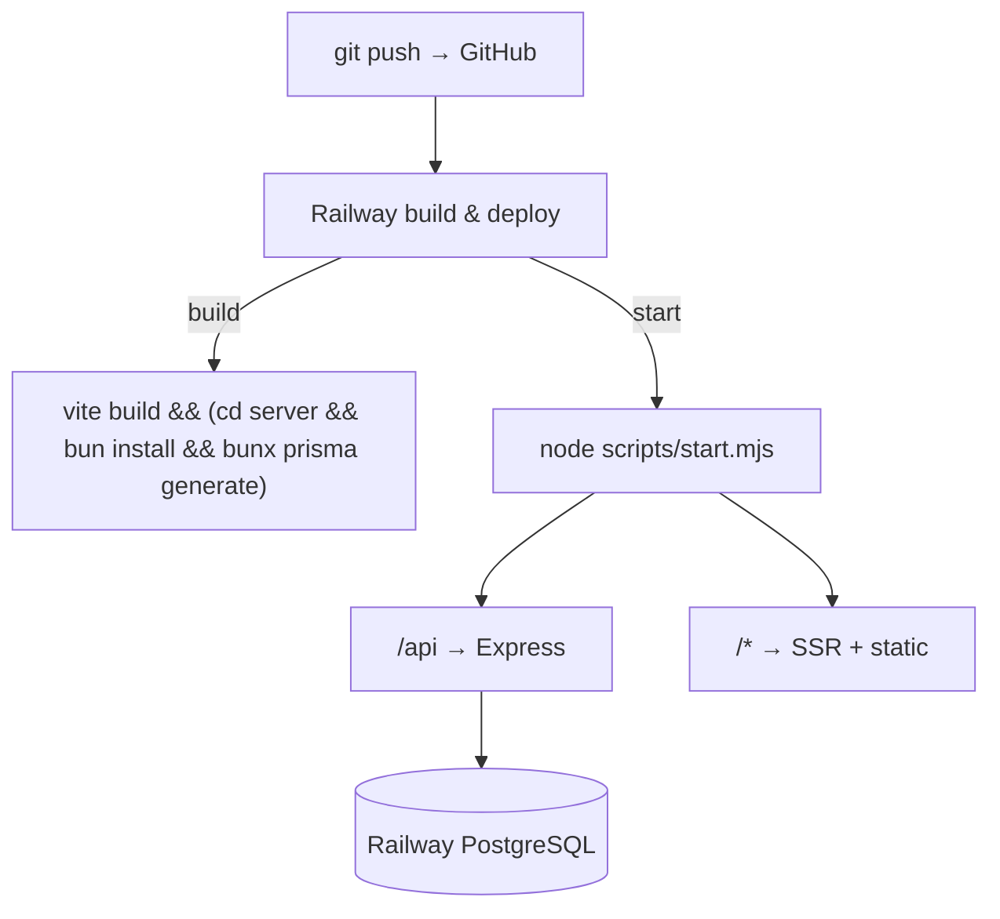

- **Local dev (frontend + API together):** `bun install && bun --bun run dev` (Vite on :3000). Backend env in root `.env` powers the merged path.
- **Local dev (API standalone):** `cd server && npm install && npm run dev` (`node --watch`, :4000) — needs the vars from root `.env` supplied another way, since there's deliberately no `server/.env` (see [Security.md](Security.md#environment-variables)).
- **Build:** `bun --bun run build` → `vite build` then server install + `prisma generate`.
- **Push schema changes:** `./server/node_modules/.bin/prisma db push --schema=server/prisma/schema.prisma` (run from root) — actual practice, not `prisma:migrate`/`prisma:deploy`; see [Schema.md](Schema.md#schema-change-workflow).
- **Docker / Compose / Kubernetes / GitHub Actions CI:** none present. Deploy is Railway-native.

## Configuration Guide

| File | Purpose |
| --- | --- |
| `vite.config.ts` | Vite plugins: devtools, tailwind, TanStack Start, React |
| `tsconfig.json` / `tsr.config.json` | TS config + TanStack Router codegen |
| `eslint.config.js` / `prettier.config.js` | Lint + format (`@tanstack/eslint-config`) |
| `components.json` | shadcn/ui generator config |
| `server/prisma/schema.prisma` | Data model, enums, datasource — see [Schema.md](Schema.md) |
| `server/src/config/env.js` | Env validation + defaults (required: `DATABASE_URL`, `JWT_SECRET`) |
| `server/src/config/db.js` | Prisma client singleton |
| `scripts/start.mjs` | Prod server: MIME map, static caching, API/SSR routing |

## Automation

| Concern | Status |
| --- | --- |
| Cron jobs / Scheduled tasks | None in repo |
| Queues / Background workers | None |
| Webhooks | None |
| Retries / timeouts | Rate limiters (login 10/15min, password-reset/change/email-change 5/hr); account lock 15 min after 5 fails |
| Async side-effects | Audit logging (`logAuthEvent`) is fire-and-forget; failures logged to console, never block auth |

## Performance

- **Static caching:** hashed `assets/*` served `immutable, max-age=1y`; other static `max-age=1h` (`start.mjs`).
- **SSR:** TanStack Start server rendering for fast first paint.
- **DB indexes:** unique constraints + composite/lookup indexes on the highest-growth tables (`auth_events`, `notifications`, `bookings`, `dining_tables`, `admin_action_events`) — see [Schema.md](Schema.md#keys--constraints--indexes).
- **Pagination:** `notifications`/`bookings`/`dining-reservations`/`guests` list endpoints are bounded (`take`, capped) instead of unbounded `findMany`, with `select` narrowed to only the fields each client view actually reads instead of full related rows.
- **Query dedupe:** ownership-check middleware stashes the record it fetches (`req.record`) so the handler that runs next doesn't re-fetch the same row.
- **Client state:** zustand avoids over-fetching; profile persisted locally.
- **Caching layer / Redis / CDN:** none beyond HTTP cache headers.

## Testing

- **Runner:** Vitest + `@testing-library/react` + `jsdom`.
- **Command:** `bun --bun run test` → `vitest run`.
- **Scope present:** unit/component harness configured.
- **Integration / E2E / coverage config:** none committed.

## Backup & Recovery

- **Database:** managed by Railway PostgreSQL — use Railway backups/snapshots + `pg_dump` for logical backups.
- **File storage:** no user-uploaded files (images are static/remote references) — nothing app-side to back up.
- **Recovery:** restore Postgres snapshot → re-run `prisma migrate deploy` → redeploy service.
- **Disaster recovery:** no documented DR/runbook; relies on Railway platform durability.

## Diagrams

### Dependency Graph

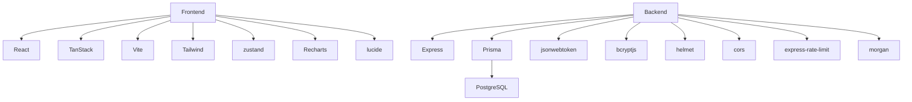

### Data Flow Diagram

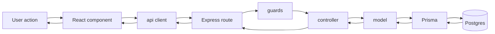

### Infrastructure Diagram

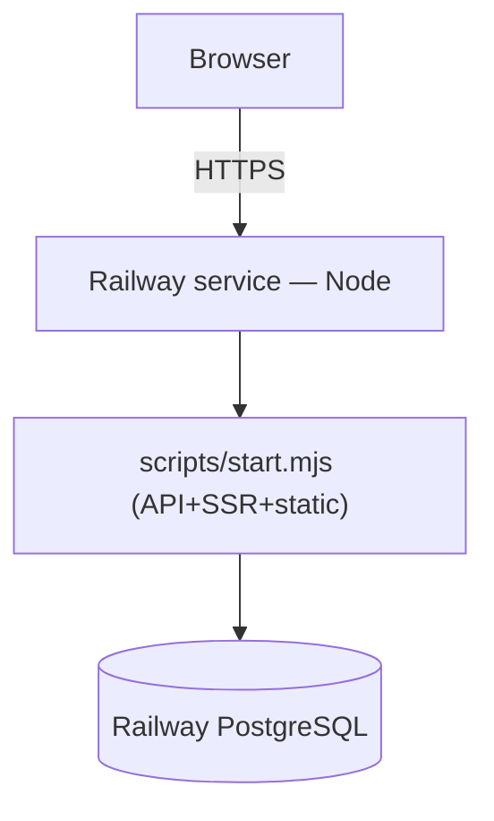

### Network Flow Diagram

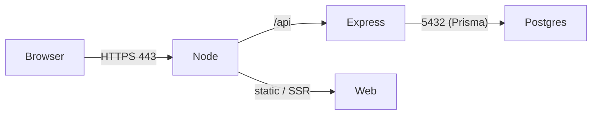

### Package Diagram

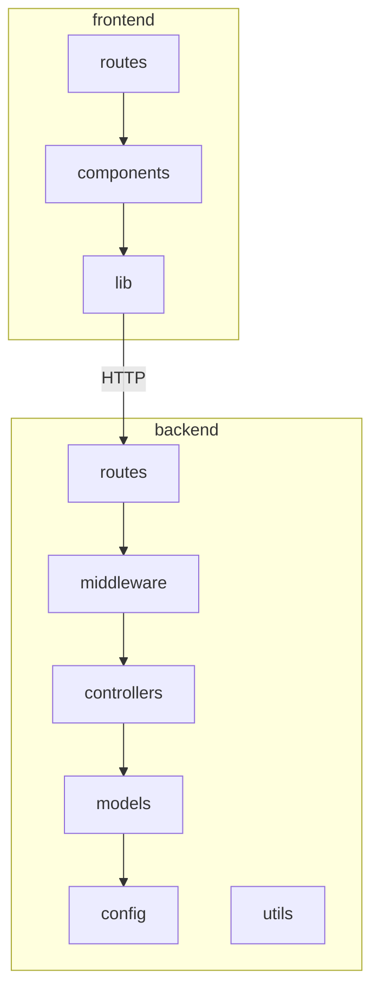

### Component Diagram

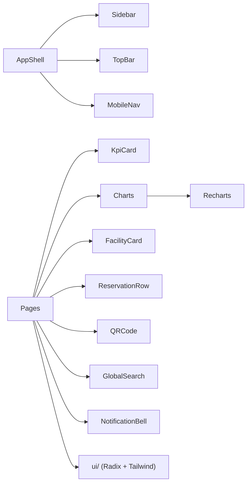

### Class Diagram (Models)

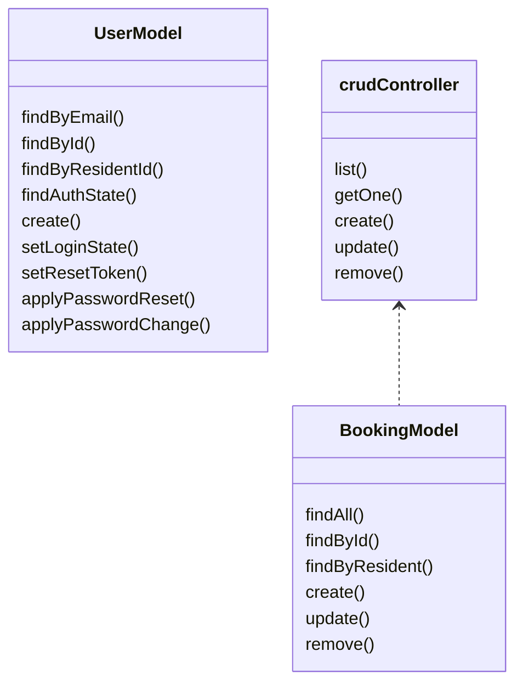

## Maintenance Guide

- **Update deps:** bump `package.json` / `server/package.json`, reinstall, run tests + lint.
- **Schema change:** edit `schema.prisma` → `db push` from root (see [Schema.md](Schema.md#schema-change-workflow)) — not `prisma:migrate`/`prisma:deploy`, despite those scripts existing in `server/package.json`.
- **Deploy:** push to GitHub → Railway auto-builds/starts.
- **Rollback:** redeploy previous Railway deployment; revert schema with a compensating `db push`, never by hand-editing data or reverting via a stale migration file.
- **Rotate demo creds:** `TEST_PASSWORD=… node server/scripts/reset-test-passwords.js`.
- **Create STAFF/MGMT users:** manually via seed / Prisma Studio (no API endpoint by design).
- **Create a resident login:** MANAGEMENT-only, via the app UI (Users page → Create Login / Add Member) or `POST /residents/:id/create-login` directly — no seed/Studio step needed.
- **Schema change via CLI:** run from repo root using server's pinned binary + explicit schema path (there's no `server/.env` for a `cd server`-relative Prisma invocation to find): `./server/node_modules/.bin/prisma db push --schema=server/prisma/schema.prisma`. This project uses `db push` day-to-day rather than `migrate dev`/`deploy`.

## Credits

- **Author:** QUAN7UM
- **Contributors:** none documented.
- **Company:** not specified.
- **License:** see [License.md](License.md).
