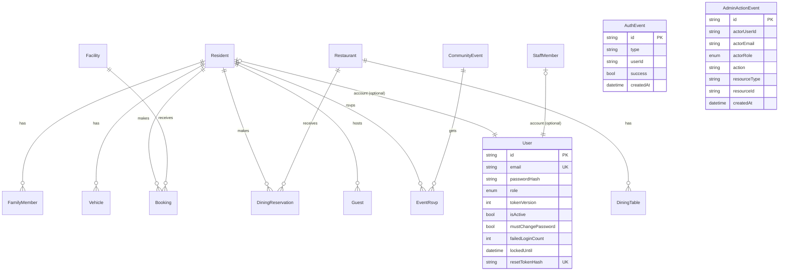

# StayFlow — Schema

> Source of truth is `server/prisma/schema.prisma` — this doc summarizes it. Business rules built on top of this schema: [Rules.md](Rules.md).

**Datasource:** PostgreSQL. **PKs:** `cuid()` text ids on all models. **Migration:** `server/prisma/migrations/0_init`.

## Tables (17) + enums (7)

`residents`, `family_members`, `vehicles`, `staff_members`, `facilities`, `bookings`, `restaurants`, `dining_tables`, `dining_reservations`, `guests`, `events`, `event_rsvps`, `notices`, `notifications`, `users`, `auth_events`, `admin_action_events`.

Enums: `MembershipTier`, `BookingStatus`, `FacilityStatus`, `TableStatus`, `DiningReservationStatus`, `GuestStatus`, `PortalRole`.

## Keys / constraints / indexes

- **Unique:** `residents.email`, `staff_members.email`, `guests.passNumber`, `users.email`, `users.residentId`, `users.staffId`, `users.resetTokenHash`, `event_rsvps (eventId,residentId)`.
- **FKs:** `family_members`/`vehicles`/`bookings`/`dining_reservations`/`guests`/`event_rsvps` → `Resident`; `bookings` → `Facility`; `dining_tables`/`dining_reservations` → `Restaurant`; `notifications` → `Resident?`/`StaffMember?` (nullable, `onDelete: Cascade`); `users` → `Resident?`/`StaffMember?` (nullable, explicit `onDelete: Restrict` — a resident/staff record with a linked login can never be deleted out from under it, added 2026-07-22 after an incident where the implicit default for an optional FK, `SetNull`, let a staff record be deleted while silently orphaning its login).
- **Cascade delete:** `family_members`, `vehicles`, `event_rsvps`, `notifications` (on resident/staff delete).
- **Restrict delete:** `users.residentId`/`users.staffId` (see above).
- **Indexes:** `auth_events` on `userId`/`type`/`createdAt`; `notifications` on `residentId`/`staffId`; `bookings` on `[facilityId,date,status]`; `dining_tables` on `[restaurantId,status]`; `admin_action_events` on `[resourceType,resourceId]`/`actorUserId`/`createdAt` (all added 2026-07-22 as part of a performance pass on the highest-growth tables).
- `auth_events` and `admin_action_events` intentionally have **no FK** to `users` — audit history outlives deleted accounts.

## ER Diagram

## State-bearing enums

| Enum | Values (see schema for exact set) | Governs |
| --- | --- | --- |
| `BookingStatus` | PENDING → CONFIRMED / CANCELLED | Facility bookings |
| `DiningReservationStatus` | mirrors booking lifecycle | Dining reservations |
| `GuestStatus` | PENDING → APPROVED → CHECKED_IN → CHECKED_OUT | Guest pass lifecycle |
| `FacilityStatus` / `TableStatus` | availability state | Facility / dining-table listing |
| `PortalRole` | MEMBER / STAFF / MANAGEMENT | `users.role`, drives RBAC |
| `MembershipTier` | resident tier | `residents.membershipTier` |

## Schema-change workflow

**Actual practice: `prisma db push`, not `migrate dev`/`deploy`.** `server/prisma/migrations/` still only contains the original `0_init` — every schema change since (including `AdminActionEvent`, `mustChangePassword`, the composite indexes) went live via `db push` directly against the Railway DB, run from repo root with server's pinned binary (there's no `server/.env` for a `cd server`-relative invocation to find):

1. Edit `server/prisma/schema.prisma`.
2. `./server/node_modules/.bin/prisma db push --schema=server/prisma/schema.prisma` — syncs the live DB and regenerates the client in one step, no migration file produced.
3. No separate dev/prod step — the same command targets whatever `DATABASE_URL` resolves to (this project has one environment: the Railway DB, both for local dev and prod).

The `migrate dev`/`migrate deploy` scripts in `server/package.json` exist but aren't the path actually used — reconciling the migration history with a `migrate dev --create-only` baseline is a known gap, not yet done.
